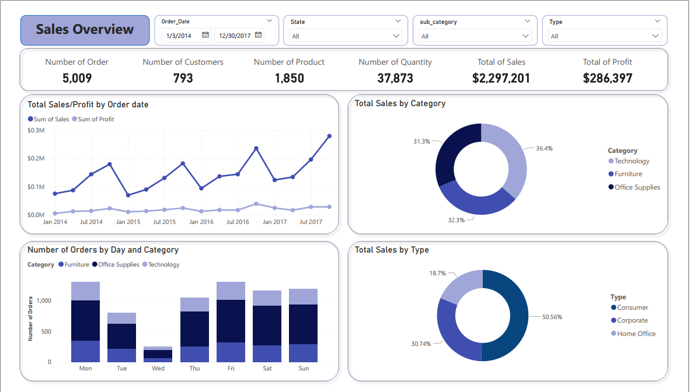
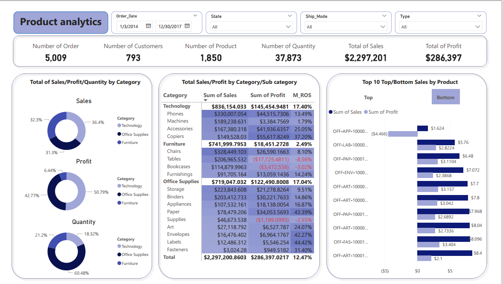
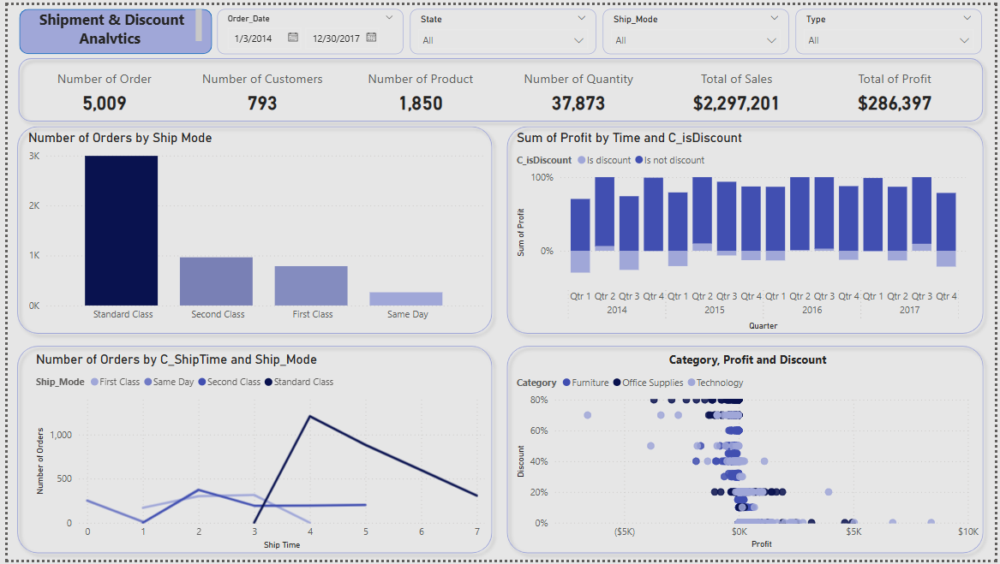

# 🛒 Business Performance Analysis – Retail Store Dataset

A data analytics project that explores key business performance metrics using a retail store dataset (from Kaggle). The analysis focuses on sales, profit, customer behavior, delivery methods, and the impact of promotional strategies over the period 2014–2017.

---

## 📊 Overview

- **Objective:** Identify key factors affecting revenue and profit. Generate insights to support strategic decision-making for sales, marketing, and customer retention.
- **Dataset:** Superstore Sales dataset (9,994 records, 21 fields)
- **Tools Used:** SQL, Power BI, Excel

---

## ⚙️ Project Steps

1. **Data Cleaning & Preparation**
   - Removed missing values and duplicates
   - Converted date columns for time-based analysis
   - Created new features: customer type, first purchase date, delivery duration, etc.

2. **Exploratory Data Analysis (EDA)**
   - Analyzed performance by product categories and sub-categories
   - Segmented customers (e.g., new vs. returning)
   - Evaluated sales by region and state

3. **Insights & Business Recommendations**
   - 📈 **Technology** category yielded the highest profit margin despite lower sales volume  
   - 📉 **Furniture** included several loss-making products (e.g., Tables, Bookcases)  
   - 🔁 High returning customer rate, but a significant drop in new customers after 2015  
   - 🚚 Most orders used **Standard Class** delivery; faster methods underutilized  
   - 💸 Discounts above 20% often resulted in **negative profit**

---

## 🧠 Key Skills Demonstrated

- Data Cleaning and Transformation (SQL, Power BI)
- Data Visualization and Dashboarding
- Business Performance Metrics
- Profitability and Customer Segmentation
- Analytical Thinking and Insight Generation

---

## 📷 Data Analysis

### 🔹 Sales Overview

- Product categories: Technology, Furniture, and Office Supplies  
- Revenue distribution among categories is relatively even (less than 5% difference)
- Customer segments:
  - Consumer: 50.56%
  - Corporate: 30.74%
  - Home Office: 17.75%

---

### 🔹 Customer Segmentation

**Number of Customers Over Time**  
- From 2014 to 2017, the total number of customers increased by 260%.  
- However, new customer numbers dropped by 97.5% (from 121 in 2014 to 3 in 2017), especially from Q3 2014 to Q1 2015.  
➡️ *Requires investigation into the reason for this drop.*

**Customer Retention Rate (by month after first order)**  
- High retention rates, especially in Q4 (>40%)  
➡️ *Indicates strong retention strategy contributing to steady revenue despite fewer new customers.*

**Top 5 Customers (by orders & profit)**  
- Suggestion: Implement loyalty programs such as VIP tiers or referral incentives to attract new and retain existing customers.

**Customer Distribution by State**  
- Highest concentrations in California (577), New York (415), and Texas (370)  
➡️ *Opportunity to boost growth in Florida due to similar population profile.*

**Profit by Customer and Type**  
- Detected outliers showing unusual profit patterns  
➡️ *Further analysis needed to check for possible fraud or anomalies.*

---

### 🔹 Product Analytics

**Sales / Profit / Quantity by Category**  
- **Technology**: Highest profit margin (17.4%) with relatively lower sales volume  
- **Office Supplies**: Second highest margin (17.04%) and highest quantity sold (60.48%)  
- **Furniture**: Lowest margin (2.49%)

**Sales and Profit by Sub-Category**

- **Technology**:
  - Copiers: Highest profit ($55.6k), despite lowest revenue ($149k), profit margin ~37.2%
  - Machines: Lowest profit ($3.4k), ~$52k less than Copiers

- **Office Supplies**:
  - Paper: Most profitable sub-category ($34k), margin ~43.39%
  - Supplies: Loss-making sub-category (-$1.2k), margin ~-2.55%

- **Furniture**:
  - Chairs: Highest profit ($26k)
  - Bookcases & Tables: Losses of -$3.4k and -$17.7k, with margins of -3.02% and -8.56%

---

### 🔹 Other Factor Analysis

**Orders by Shipping Mode**  
- **Standard Class**: Dominates with ~3,000 orders (~60%)  
- **Same Day**: Least used  
- **Second Class** and **First Class**: Moderate usage (~1,000 and ~800 orders respectively)

**Delivery Time by Shipping Mode**  
- Same Day: < 1 day  
- First Class: 1–3 days  
- Second Class: 2–5 days  
- Standard Class: 4–7 days

**Monthly Profit vs. Discounted Orders**  
- Some months had a high number of discounted orders, reducing overall profit  
➡️ *Requires analysis to understand why promotions were concentrated in those months*

**Profit by Discount Level**  
- Discounts <20%: Generally profitable  
- Discounts >20%: Often lead to losses  
➡️ *Evaluate the effectiveness and intent behind these promotions*

---

## 📁 Dataset Source

- [Superstore Sales Dataset – Kaggle](https://www.kaggle.com/datasets)

---

## 👨‍💻 Author

**Hỏa Ngọc Tú – [SooBul]**  
📧 ngoctu0984339401@gmail.com

-----------------------------------------------------------------------END---------------------------------------------------------------------------------------------------
